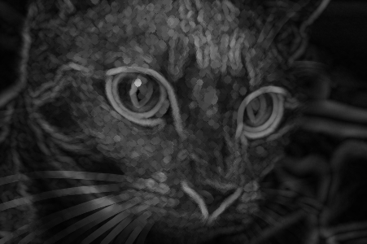

# Laboratorium 1
> Wczytywanie, wyświetlanie i zapisywanie plików graficznych, elementy strukturalne, filtry uśredniające i medianowe, segmentacja.

## Używane moduły

- [data](http://scikit-image.org/docs/dev/api/skimage.data.html) — standardowe obrazy testowe,
- [io](http://scikit-image.org/docs/dev/api/skimage.io.html) — odczytywanie i zapisywanie obrazów,
- [filters](http://scikit-image.org/docs/dev/api/skimage.filters.html) - filtrowanie obrazów,
- [util](http://scikit-image.org/docs/dev/api/skimage.util.html) - funkcje pomocnicze,
- [morphology](http://scikit-image.org/docs/dev/api/skimage.morphology.html) - operacje morfologiczne.

## Operacje
### Wczytywanie, wyświetlanie i zapisywanie plików graficznych

Baza obrazów.

```python
image = data.coins()
```

Wczytywanie z pliku.

```python
image = io.imread('lena.png')
```

Wyświetlenie.

```python
io.imshow(image)
io.show()
```

Zapis do pliku.

```python
io.imsave('foo.png', image)
```

### Filtrowanie

Wczytujemy obraz.

```python
image = io.imread('lena.png')
```


I dodajemy szum typu pieprz i sól.

```python
noisedImage = util.random_noise(image, mode = 's&p')
```


#### Filtr uśredniający

Najpopularniejszym jest filtr Gaussa.

```python
gau = filters.gaussian(image, sigma = .5)
```


#### Filtr medianowy
Niezbędny jest element strukturalny.

```python
selem = morphology.disk(5)
```

Filtrujemy, jako argumenty podając obraz i element strukturalny.

```python
med = filters.median(image, selem)
```


### Operacje morfologiczne


#### Dylatacja

```python
dil = morphology.dilation(image, selem)
```


#### Erozja

```python
ero = morphology.erosion(image, selem)
```


## Zadania

### Filtrowanie [3]

Dla wybranego przez siebie obrazu, wczytanego z pliku, napisz skrypt, który zbada sześć różnych filtrów, po trzy uśredniające i medianowe. Używaj różnych elementów strukturalnych.

### Przekształcenia morfologiczne [4]
Dane jest proste przekształcenie morfologiczne, będące różnicą pomiędzy mapą dylatacji i erozji obrazu:

```python
dif = dil - ero
```

które produkuje obrazy podobne do poniższego.



Jakie zastosowanie można znaleźć dla tego przekształcenia? Odpowiedź uzasadnij.

### Segmentacja [5]

Korzystając z poniższego tutoriala, przygotuj skrypt zdolny do segmentacji wybranego przez ciebie obrazu. Spróbuj poprawić jakość segmentacji, stosując filtrowanie i przekształcenia morfologiczne. Zaprezentuj zarówno początkową segmentację jak i tę poprawioną.

- [Image Segmentation tutorial](http://scikit-image.org/docs/dev/user_guide/tutorial_segmentation.html)
