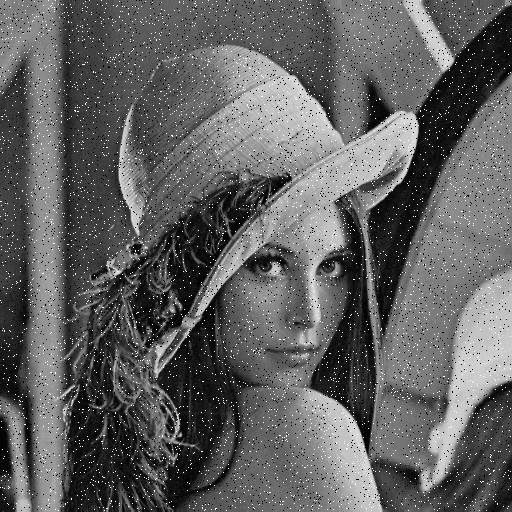
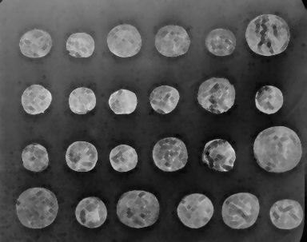

# Laboratorium 1
> Wczytywanie, wyświetlanie i zapisywanie plików graficznych, elementy strukturalne, filtry uśredniające i medianowe, dylatacja, erozja i konturowanie.

## Używane moduły

```python
from skimage import data, io, filters, util, morphology
```

- [data](http://scikit-image.org/docs/dev/api/skimage.data.html) — standardowe obrazy testowe,
- [io](http://scikit-image.org/docs/dev/api/skimage.io.html) — odczytywanie i zapisywanie obrazów
- [filters](http://scikit-image.org/docs/dev/api/skimage.filters.html)
- [util](http://scikit-image.org/docs/dev/api/skimage.util.html)
- [morphology](http://scikit-image.org/docs/dev/api/skimage.morphology.html)

## Operacje
### Wczytywanie, wyświetlanie i zapisywanie plików graficznych

Baza danych.

```python
image = data.coins()
```

Plik.

```python
image = io.imread('lena.png')
```

Wyświetlenie.

```python
io.imshow(image)
io.show()
```

Zapis do pliku.

```python
io.imsave('foo.png', image)
```

### Filtrowanie

Wczytujemy obraz.

```python
image = io.imread('lena.png')
```


I dodajemy szum typu pieprz i sól.

```python
noisedImage = util.random_noise(image, mode = 's&p')
```




#### Filtr uśredniający

Na przykład Gaussa.

```python
gau = filters.gaussian(image, sigma = .5)
```


#### Filtr medianowy
Tworzymy element strukturalny

```python
selem = morphology.disk(5)
```

Filtrujemy.

```python
med = filters.median(image, selem)
```


### Dylatacja

```python
dil = morphology.dilation(image, selem)
```


### Erozja

```python
ero = morphology.erosion(image, selem)
```



### Konturowanie

```
sob = filters.sobel(image)
```


## Zadania

Dla wybranego przez siebie obrazu, wczytanego z pliku, napisz skrypt, który zbada:

- Sześć różnych filtrów.
- Watersheding zarówno po erozji jak dylatacji.
