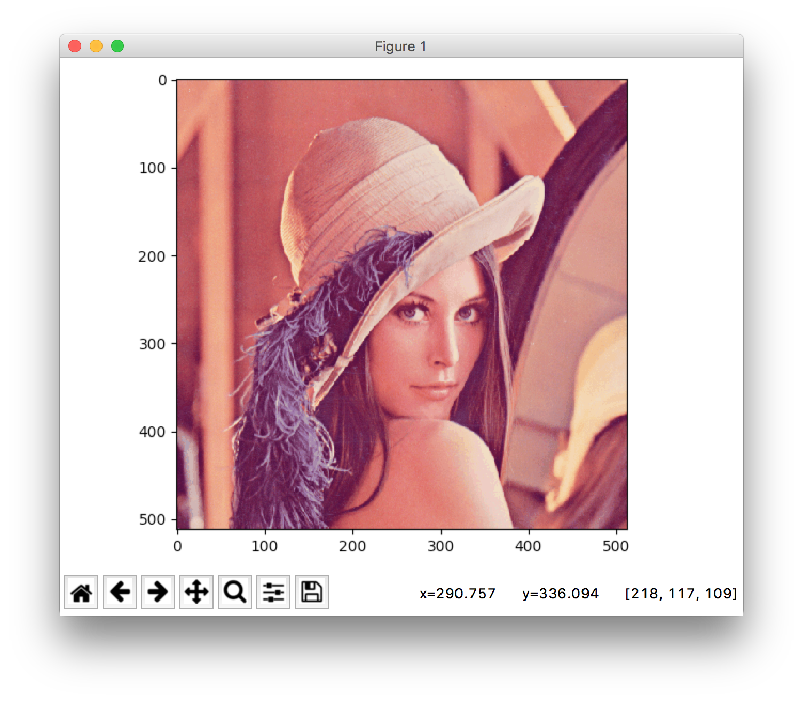
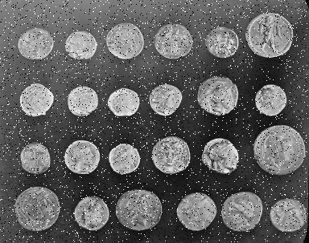
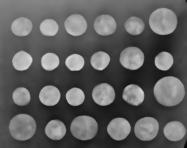
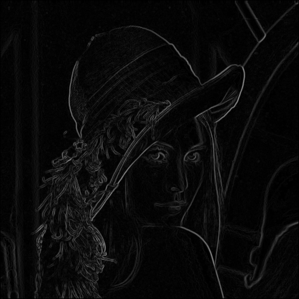

# Laboratorium 1

```python
from skimage import data, io, filters, util, morphology
```

- [data](http://scikit-image.org/docs/dev/api/skimage.data.html) — standardowe obrazy testowe,
- [io](http://scikit-image.org/docs/dev/api/skimage.io.html) — odczytywanie i zapisywanie obrazów

## Wczytywanie, wyświetlanie i zapisywanie plików graficznych

Baza danych

http://scikit-image.org/docs/dev/api/skimage.data.html

```python
image = data.coins()
```

Plik

```python
image = io.imread('lena.png')
```

Wyświetlenie

```python
io.imshow(image)
io.show()
```



Zapis do pliku.

```python
io.imsave('foo.png', image)
```


## Filtrowanie

Wczytujemy obraz, ograniczamy go tylko do kanału zielonego i dodajemy szum.

```
image = io.imread('lena.png')
image = image[:,:,1]
```


```
noisedImage = util.random_noise(image, mode = 's&p')
```




Filtr gaussowski

```
gau = filters.gaussian(image, sigma = .5)
```


Filtr medianowy Tworzymy element strukturalny

```
selem = morphology.disk(5)
med = filters.median(image, selem)
```



## Wykrywanie krawędzi

```
sob = filters.sobel(med)
```



## Dylatacja


## Erozja
